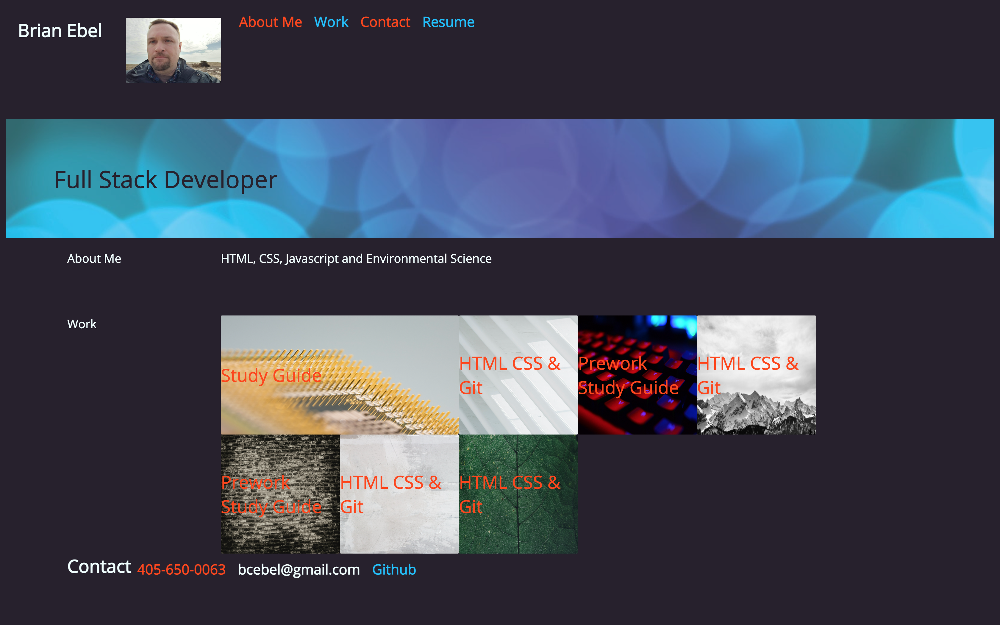

# Advanced CSS Challenge: Professional Portfolio

## Description

Responsive portfolio site.  It features flex-box and grid css properties.  

## Installation
The URL will work in modern browsers:
Chrome, Edge, Firefox, Safari & Opera.

## Usage
Use the navigation bar at the top to bring you to the different sections.  Click on the blocks in the work section to see the assignments.

## Credits
Thanks to UNH Coding Bootcamp & edX for the support.

## License
Please refer to the license in the Repo
